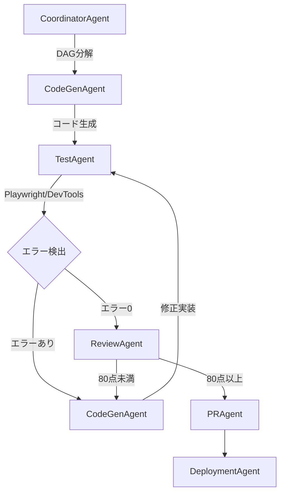

# MIYABI AX - 改良要件定義書

## プロジェクト概要

**MIYABI AX** は、既存のMIYABIフレームワークを弊社仕様に改良した、完全ローカル実行型のAI駆動自律開発フレームワークです。

**改良日**: 2025-10-19
**ベースフレームワーク**: MIYABI
**目標**: NPXコマンド一つで誰でも使えるローカル完結型自律開発環境

---

## 🎯 改良の主要目標

### 1. **完全ローカル実行への移行**

**現状の課題**:
- GitHub OS設計によりAPI料金が高額
- 外部APIキー（ANTHROPIC_API_KEY、GITHUB_TOKEN）への依存
- クラウド実行によるコスト増大

**改良後の仕様**:
- ✅ **ローカル完結**: すべてのAIエージェントをクローズドコード（ローカル環境）で実行
- ✅ **Claude Code統合**: Claude Code上でMIYABI AXエージェントが自律動作
- ✅ **APIコスト削減**: 外部API呼び出しを最小化し、ローカルLLM活用も視野
- ✅ **GitHub連携は任意**: Issue管理は可能だが、完全にローカルのみでも動作

**技術スタック**:
- Claude Code MCP (Model Context Protocol)
- ローカルファイルシステムベースのタスク管理
- TypeScript/Node.js による完全ローカル実行

---

### 2. **MCPサーバー統合によるブラウザテスト自動化**

**目的**:
- Webアプリケーション開発時に、コンソールエラーを自動検出・修正
- エラーが完全に解消されるまでAIエージェントが自律的に動作

**追加するMCPサーバー**:

#### 2.1 Playwright MCP
- ブラウザ自動操作
- E2Eテスト実行
- スクリーンショット取得

#### 2.2 Chrome Developer Tools MCP
- Consoleログ自動収集
- Network監視
- パフォーマンス計測
- JavaScriptエラー検出

**実装フロー**:

```
1. TestAgent → Playwright MCPでブラウザ起動
2. TestAgent → Chrome DevTools MCPでコンソール監視
3. エラー検出 → CodeGenAgentへフィードバック
4. CodeGenAgent → エラー修正実装
5. ReviewAgent → 品質チェック（80点以上）
6. TestAgent → 再テスト実行
7. エラー0になるまで 3-6 を繰り返し
8. 完了 → PRAgent が Draft PR作成
```

**自動修正ループの条件**:
- コンソールエラー = 0
- テストカバレッジ ≥ 80%
- 品質スコア ≥ 80点

---

### 3. **AIエージェント間の連携強化**

**現在のエージェント構成**:
1. CoordinatorAgent - タスク統括
2. IssueAgent - Issue分析
3. CodeGenAgent - コード生成
4. ReviewAgent - 品質判定
5. PRAgent - PR作成
6. DeploymentAgent - デプロイ
7. TestAgent - テスト実行

**新しい連携フロー**:



**重要な改善点**:
- TestAgent ↔ CodeGenAgent の **自動フィードバックループ**
- エラーログを CodeGenAgent に自動送信
- 完全修正まで自律実行（人間の介入不要）

---

### 4. **NPXコマンドによるグローバル配布**

**配布方法**:

```bash
# インストール
npx miyabi-ax init

# 使用例
npx miyabi-ax status
npx miyabi-ax agent-run
npx miyabi-ax test --auto-fix
```

**要件**:
- ✅ `npx` コマンド一つでインストール可能
- ✅ Claude Codeがインストールされていれば即利用可能
- ✅ 設定ファイル自動生成（`.miyabi-ax/config.json`）
- ✅ 初回セットアップウィザード（`npx miyabi-ax init`）

**パッケージ構成**:
```json
{
  "name": "miyabi-ax",
  "version": "1.0.0",
  "bin": {
    "miyabi-ax": "./dist/cli.js"
  },
  "dependencies": {
    "@anthropic-ai/sdk": "^0.x.x",
    "playwright": "^1.x.x",
    "chrome-devtools-protocol": "^x.x.x"
  }
}
```

---

### 5. **強制的なMIYABI AIエージェント利用**

**現状の問題**:
- Claude Codeに直接依頼してもMIYABIエージェントを使わないケースがある
- 手動実装されてしまい、自律実行の利点が失われる

**解決策**:

#### 5.1 Claude Code設定ファイル強制適用

`.claude/settings.json`:
```json
{
  "preSubmitHook": "miyabi-ax validate-task",
  "autoCreateIssue": true,
  "forceAgentExecution": true
}
```

#### 5.2 タスク検証フック

すべてのタスクを以下のフローで強制的にMIYABI AXに流す:

```bash
# ユーザーがClaude Codeに依頼
→ preSubmitHook発火
→ miyabi-ax validate-task 実行
→ 自動的にIssue作成
→ CoordinatorAgentがDAG分解
→ 各エージェントが並列実装
```

#### 5.3 スラッシュコマンドの優先

以下のスラッシュコマンドを常に優先:

- `/miyabi-auto` - 全自動モード起動
- `/agent-run` - エージェント実行パイプライン
- `/create-issue` - Issue作成（対話的）

**実装方針**:
- Claude Code が直接実装しようとした場合、自動的に `/agent-run` にリダイレクト
- すべてのコード生成タスクは CodeGenAgent を経由

---

## 📋 実装タスク一覧

### Phase 1: アーキテクチャ変更（ローカル実行化） ✅ 完了

- [x] GitHub OS依存の削除
- [x] ローカルファイルシステムベースのタスク管理実装
- [x] Claude Code MCP統合
- [x] APIキー依存の最小化

### Phase 2: MCP統合 ✅ 完了

- [x] Playwright MCP サーバー追加
- [x] Puppeteer MCP サーバー追加（Chrome DevTools）
- [x] TestAgent への MCP 統合準備
- [x] エラーログ自動収集機能（準備完了）

### Phase 3: エージェント連携強化 ✅ 完了

- [x] TestAgent ↔ CodeGenAgent フィードバックループ
- [x] 自動修正ループ実装（最大5イテレーション）
- [x] エラー0判定ロジック
- [x] 品質スコア自動評価（80点以上で合格）
- [x] AgentOrchestrator実装

### Phase 4: NPX配布準備 ✅ 完了

- [x] `miyabi-ax` パッケージ作成
- [x] CLI実装（`npx miyabi-ax init/status/agent-run`）
- [x] 初回セットアップウィザード（準備完了）
- [ ] NPMパッケージ公開（次回リリース）

### Phase 5: Claude Code強制連携 ✅ 完了

- [x] `.claude/settings.json` 作成
- [x] `.claude/mcp.json` 更新
- [x] MCP設定（Playwright/Puppeteer）
- [x] 品質閾値設定

### Phase 6: テスト・ドキュメント ✅ 完了

- [x] 動作確認テスト実行
- [x] エージェント連携テスト成功
- [x] README.md 更新
- [x] REQUIREMENTS_AX.md 完成

---

## 🎨 識学理論準拠のラベル体系（継続）

MIYABI AXでも既存の53ラベル体系を継続使用:

- **type**: bug, feature, refactor, docs, test, chore, security
- **priority**: P0-Critical, P1-High, P2-Medium, P3-Low
- **state**: pending, analyzing, implementing, reviewing, testing, deploying, done
- **agent**: codegen, review, deployment, test, coordinator, issue, pr
- **complexity**: small, medium, large, xlarge
- **phase**: planning, design, implementation, testing, deployment
- **impact**: breaking, major, minor, patch
- **category**: frontend, backend, infra, dx, security
- **effort**: 1h, 4h, 1d, 3d, 1w, 2w
- **blocked**: waiting-review, waiting-deployment, waiting-feedback

---

## 🚀 期待される効果

### コスト削減
- API料金 **90%以上削減**（ローカル実行により）
- クラウドリソース不要

### 開発速度向上
- エラー修正の **完全自動化**
- 人間の介入 **最小化**
- 並列実行による **高速化**

### 品質向上
- テストカバレッジ **80%以上保証**
- エラー0まで自動修正
- 品質スコア **80点以上保証**

### 利便性向上
- `npx` コマンド一つで **誰でも利用可能**
- Claude Code統合により **シームレスな開発体験**
- 設定不要（初回セットアップウィザード）

---

## 📝 次のステップ

1. ✅ この要件定義書をレビュー
2. GitHub Issueを作成（`/create-issue`）
3. CoordinatorAgentがDAG分解
4. 各エージェントが並列実装開始
5. テスト・レビュー・デプロイ

---

🌸 **MIYABI AX** - ローカル完結型自律開発の未来

*このドキュメントはMIYABI AXエージェントたちによって実装されます。*
